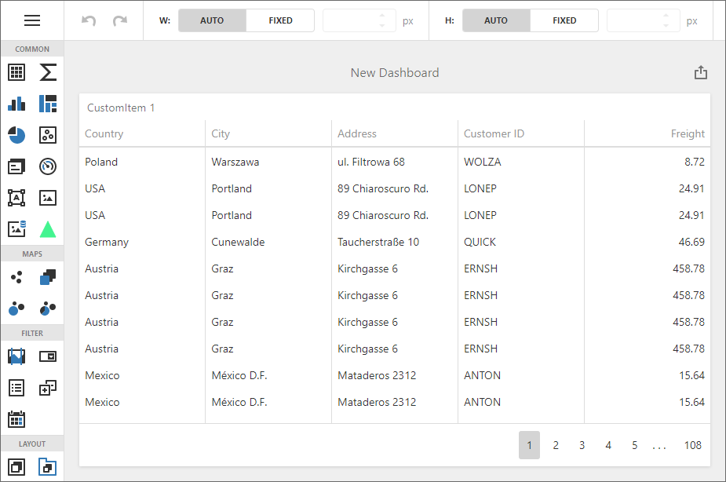

# Dashboard for Web Forms - How to show underlying data in a custom grid dashboard item

This example illustrates how to create a custom grid dashboard item based on the [dxDataGrid](https://js.devexpress.com/Documentation/ApiReference/UI_Components/dxDataGrid/) UI component. The [ViewerApiExtension.requestUnderlyingData](https://docs.devexpress.com/Dashboard/js-DevExpress.Dashboard.ViewerApiExtension#js_devexpress_dashboard_viewerapiextension_requestunderlyingdata) method is used to get the underlying data and then show this data in `dxDataGrid`.

## Files to Look At

* [Default.aspx](./CS/Default.aspx) (VB: [Default.aspx](./VB/Default.aspx))
* [Default.aspx.cs](./CS/Default.aspx.cs) (VB: [Default.aspx.vb](./VB/Default.aspx.vb))
* [CustomGridExtension.js](./CS/Scripts/CustomGridExtension.js) (VB: [CustomGrid.js](./VB/Scripts/CustomGridExtension.js))

## Documentation

- [ASP.NET Web Forms Dashboard Control - Client-Side API Overview](https://docs.devexpress.com/Dashboard/116302/web-dashboard/aspnet-web-forms-dashboard-control/client-side-api-overview)
- [Obtain Underlying and Displayed Data in ASP.NET Web Forms Dashboard Control](https://docs.devexpress.com/Dashboard/18078/web-dashboard/aspnet-web-forms-dashboard-control/obtain-underlying-and-displayed-data)
- [Create a Custom Item](https://docs.devexpress.com/Dashboard/117546/web-dashboard/ui-elements-and-customization/create-a-custom-item)

## More Examples

- [Dashboard for Web Forms - How to get data from a clicked dashboard item](https://github.com/DevExpress-Examples/Web-Dashboard---How-to-get-data-from-a-clicked-dashboard-item)
- [Dashboard for Web Forms - How to obtain a dashboard item's underlying data for a clicked visual element](https://github.com/DevExpress-Examples/aspxdashboard-how-to-obtain-a-dashboard-items-underlying-data-for-a-clicked-visual-element-t492257)
- [Dashboard for Web Forms - How to obtain underlying data for the specified dashboard item](https://github.com/DevExpress-Examples/aspxdashboard-how-to-obtain-underlying-data-for-the-specified-dashboard-item-t518504)
- [Dashboard for ASP.NET Core - How to obtain a dashboard item's client data](https://github.com/DevExpress-Examples/asp-net-core-dashboard-get-client-data)
- [Dashboard for ASP.NET Core  - How to obtain a dashboard item's underlying data for a clicked visual element](https://github.com/DevExpress-Examples/asp-net-core-dashboard-get-underlying-data-for-clicked-item)
- [Dashboard for ASP.NET Core  - How to obtain underlying data for the specified dashboard item](https://github.com/DevExpress-Examples/asp-net-core-dashboard-display-item-underlying-data)
